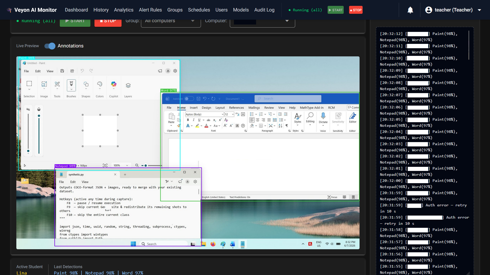
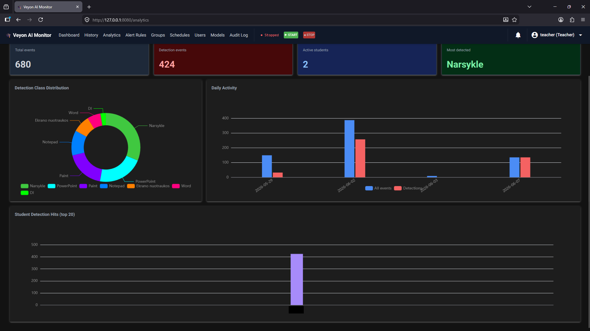
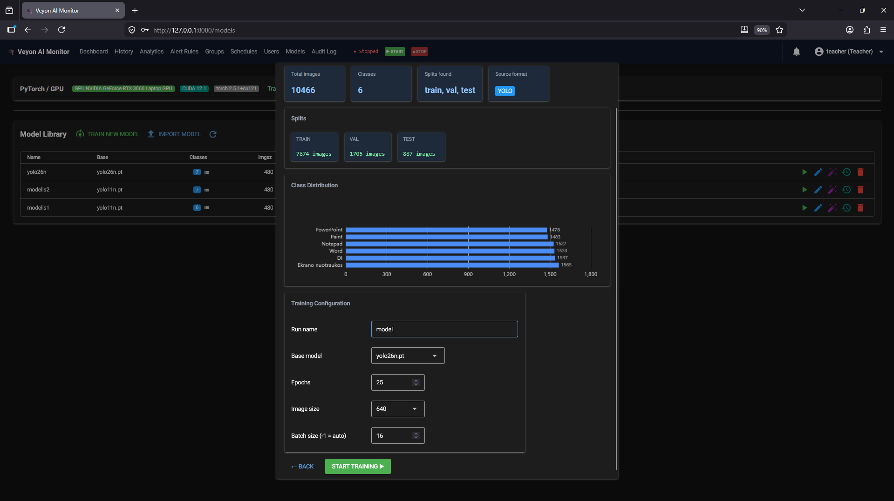
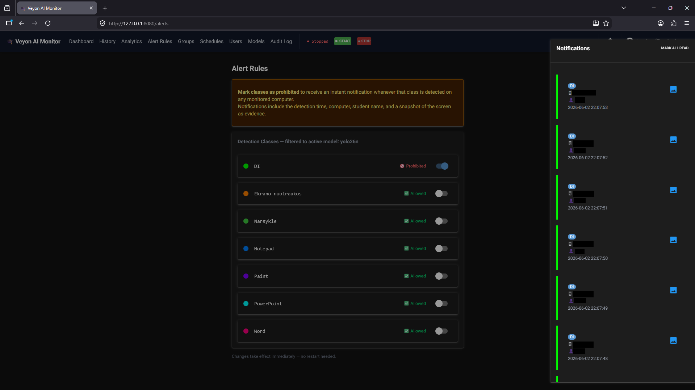
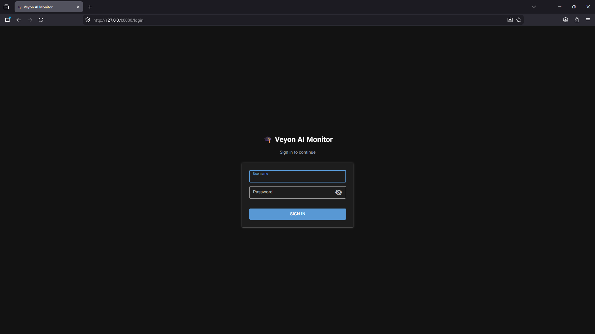

# Veyon AI Monitor

[](https://github.com/vainmari/Veyon-detection/actions/workflows/build.yml)
[](LICENSE)
[](https://www.python.org/)


A real-time screen-content monitoring platform: it captures screens from networked machines via the Veyon WebAPI, runs YOLO object detection to flag on-screen activity of interest, and presents the results in a browser dashboard whose entire UI is defined in Python (NiceGUI) — no separate JavaScript frontend to write.

The reference configuration targets **academic integrity** — detecting unauthorized AI-tool usage during exams — but the underlying engine (privacy-preserving, local screen-content analysis) is general-purpose. Swapping the detection model and the class set adapts it to any "what is on these screens, right now and over time?" problem.

<p align="center">
  
</p>

---

## Contents

- [Veyon AI Monitor](#veyon-ai-monitor)
  - [Contents](#contents)
  - [Features](#features)
  - [Screenshots](#screenshots)
  - [Use Cases](#use-cases)
  - [Quick Start](#quick-start)
  - [Installation](#installation)
    - [1. Configure Veyon (required, on every machine)](#1-configure-veyon-required-on-every-machine)
    - [2a. Option A — Prebuilt executable (recommended for everyday use)](#2a-option-a--prebuilt-executable-recommended-for-everyday-use)
    - [2b. Option B — From source (for development or customization)](#2b-option-b--from-source-for-development-or-customization)
  - [Environment \& Secrets](#environment--secrets)
  - [Project Structure](#project-structure)
  - [Architecture](#architecture)
    - [Data flow](#data-flow)
  - [Database Schema](#database-schema)
  - [User Roles](#user-roles)
  - [Configuration](#configuration)
  - [Building the EXE](#building-the-exe)
  - [Running Tests](#running-tests)
  - [CI](#ci)
  - [System Requirements](#system-requirements)
  - [License](#license)

---

## Features

- **🔒 100% local & private** — screens are processed on your own network and stored in a local SQLite database; nothing is sent to the cloud.
- **⚡ Real-time on CPU** — NMS-free YOLO26n inference at ~15 ms/frame on a CPU; full classroom detection cycle in 3–4 seconds. No GPU required (CUDA used automatically if present).
- **🎯 High accuracy** — 0.984 mAP50-95 on the 7-class reference test set.
- **🧩 Veyon-native** — captures through the existing Veyon WebAPI; no extra agent to install on monitored machines.
- **🤖 Train your own models in-app** — upload a dataset and train or fine-tune new detection classes from the UI (no ML expertise needed); exports to ONNX automatically.
- **👥 Role-based access** — admin / teacher / student roles with distinct capabilities (RBAC); login attempts are rate-limited per client IP.
- **📊 Run reports** — every monitoring session (manual or scheduled) is recorded; the Reports page shows prohibited-class alerts (who, when, with per-alert screenshots) plus per-class / per-student / per-computer breakdowns, and exports to CSV or print-ready PDF.
- **🌐 Bilingual UI** — English and Lithuanian.
- **🐍 Pure-Python UI** — built with NiceGUI; no separate JavaScript frontend to maintain.
- **🖥 Cross-platform** — runs from source on Windows, Linux, and macOS (Veyon supports Windows & Linux).
- **✅ Well-tested** — 100+ unit tests with all network / subprocess / UI calls mocked, plus CI.

---

## Screenshots

<table>
  <tr>
    <td align="center" width="50%"><br><sub><b>Analytics</b></sub></td>
    <td align="center" width="50%"><br><sub><b>In-app model training</b></sub></td>
  </tr>
  <tr>
    <td align="center" width="50%"><br><sub><b>Alert rules</b></sub></td>
    <td align="center" width="50%"><br><sub><b>Login</b></sub></td>
  </tr>
</table>

---

## Use Cases

- **Academic integrity** — flag unauthorized AI assistants or prohibited applications during exams and lab sessions (the bundled reference setup).
- **Workforce productivity** — measure time spent in work applications vs. off-task activity, with per-machine and historical breakdowns.
- **Software-usage auditing & license optimization** — see which applications are actually used, and how often, to right-size license spend.
- **UX & behavioural research** — observe real on-screen interaction patterns across a fleet of machines.
- **Corporate compliance & security monitoring** — detect prohibited tools or data-handling patterns on managed endpoints.

All analysis runs locally against your own Veyon-managed machines — no screen content leaves your network.

---

## Quick Start

```bash
# 1. Create and activate virtual environment
python -m venv .venv
.venv\Scripts\activate          # Windows
# source .venv/bin/activate     # Linux / macOS

# 2. Install dependencies
pip install -e ".[dev]"

# 3. Configure secrets
#    Copy .env.example to .env and set STORAGE_SECRET + initial admin credentials.
#    If .env is missing the app auto-creates it on first run with a random secret
#    and the default admin/admin credentials — change the password immediately.

# 4. Place your YOLO model
#    Put yolo26n.onnx (or any .pt / .onnx) inside the weights/ folder

# 5. Start the server
python run.py
# → browser opens at http://localhost:8080 automatically
```

Default login credentials are set via `INITIAL_ADMIN_USERNAME` / `INITIAL_ADMIN_PASSWORD` in `.env` (defaults: **admin / admin**). Change the password via the Users page after first login.

All runtime settings (auth keys, Veyon CLI path, detection thresholds, etc.) are configurable via the Settings page and persisted between restarts.

---

## Installation

> **Prerequisite:** this tool does not capture screens itself — it reads them through the [Veyon](https://veyon.io) WebAPI. You must configure Veyon first (below), then install the monitor via **Option A** (prebuilt `.exe`) or **Option B** (from source).

### 1. Configure Veyon (required, on every machine)

Veyon must be installed on the teacher/observer station **and** every monitored computer.

1. **Install Veyon** from <https://veyon.io/en/download/> on each machine. Keep the defaults, except on the **Components** screen: a computer that is only *monitored* (never used to observe) can uncheck **Veyon Master**; the teacher/observer machine must keep it. Click **Install**.
2. **Set the authentication method.** Open **Veyon Configurator → General** and choose **key-based (cryptographic key) authentication** on every machine. (Logon auth also works, but this guide uses keys.)
3. **Create the key pair** on the admin machine: **Authentication keys → Create key pair**, give it a name. Veyon generates a public/private pair. **Export both** keys (Export key) and store them safely:
   - the **public** key is imported on every monitored computer;
   - the **private** key is what this app authenticates with — point `key_path` at it (default `class.pem`).
4. **Import the public key** on each monitored computer (**Authentication keys → Import key**).
5. **Register the machines:** on the observer and monitored computers, under **Locations & computers**, add the same location and list each computer's name and IP address.
6. **Enable the WebAPI:** in Veyon Configurator switch **View → Advanced**, open the **Web API** section, and ensure the WebAPI server is **enabled**.

> Make sure the **port** set in this app's Settings matches Veyon's WebAPI port, and that the app can read the exported **private key**.

### 2a. Option A — Prebuilt executable (recommended for everyday use)

No Python needed.

1. Download the latest release archive (`.zip`) from the [Releases page](https://github.com/vainmari/Veyon-detection/releases).
2. Extract it anywhere, **keeping the folder structure intact** — the `.exe` needs `weights/` and `data/` alongside it.
3. Double-click the executable. If Windows SmartScreen appears, click **More info → Run anyway**.
4. After a few seconds the GUI opens in your browser. The system is ready.

### 2b. Option B — From source (for development or customization)

Full freedom to modify, extend, and rebuild the system.

```bash
git clone https://github.com/vainmari/Veyon-detection.git
cd Veyon-detection

python -m venv .venv
.venv\Scripts\activate            # Windows
# source .venv/bin/activate       # Linux / macOS

pip install -e ".[dev]"           # use ".[dev,build]" if you also want to build the .exe

python run.py                     # GUI opens at http://localhost:8080
```

Then complete first-run configuration (secrets, model, admin login) as described in [Quick Start](#quick-start) above.

---

## Environment & Secrets

Copy `.env.example` to `.env` at the repo root (or next to the EXE in `dist/`) and edit as needed. The file is `.gitignored` — never commit it.

| Variable | Required | Description |
|---|---|---|
| `STORAGE_SECRET` | **Yes** | Signs NiceGUI session cookies. Auto-generated if `.env` is absent. Rotate with `python -c "import secrets; print(secrets.token_urlsafe(48))"` |
| `INITIAL_ADMIN_USERNAME` | First run | Username of the bootstrap admin account (default: `admin`) |
| `INITIAL_ADMIN_PASSWORD` | First run | Password of the bootstrap admin account. The app **exits** on a fresh DB if this is unset. |
| `BIND_HOST` | No | Interface the web UI listens on. Default `0.0.0.0` (reachable from the LAN). Set `127.0.0.1` to restrict to the local machine, e.g. behind a TLS reverse proxy. |
| `BIND_PORT` | No | Web UI port (default `8080`). |
| `LOGIN_MAX_ATTEMPTS` | No | Failed logins allowed per client IP inside the window before lockout (default `5`). |
| `LOGIN_WINDOW_SEC` | No | Sliding-window length in seconds for login rate limiting (default `300`). |

All `VEYON_*` variables in `.env.example` are optional — they override the built-in defaults listed in the Configuration section below. Settings saved through `/settings` take highest precedence.

**Logon password** (Veyon `logon` auth mode) is stored in the OS credential vault (Windows Credential Manager / macOS Keychain / Secret Service on Linux) via `keyring` — never written to disk as plaintext.

---

## Project Structure

<details>
<summary><b>Click to expand the full source tree</b></summary>

```
repo/
│
├── run.py                          Entry point — imports app.main and starts NiceGUI
├── build.py                        PyInstaller build script (produces .exe)
├── pyproject.toml                  Project metadata and dependencies
├── .env.example                    Template for required secrets and optional overrides
│
├── weights/                        YOLO model files (.onnx / .pt)
│   └── yolo26n.onnx
│
├── data/                           Created automatically on first run
│   ├── monitor.db                  SQLite database
│   ├── datasets/                   Uploaded / extracted dataset files
│   └── models/                     Trained or fine-tuned model outputs
│
├── app/
│   ├── main.py                     App factory: startup hooks, page imports, ui.run()
│   ├── config.py                   Secrets, defaults, get/save settings, keyring routing
│   ├── state.py                    Global mutable state shared across threads
│   ├── translate.py                i18n helper (en / lt locale JSON files)
│   │
│   ├── locales/
│   │   ├── en.json                 English UI strings
│   │   └── lt.json                 Lithuanian UI strings
│   │
│   ├── core/                       Pure utilities — no UI, no business logic
│   │   ├── auth.py                 Session helpers (get/set/clear, require_auth)
│   │   ├── rate_limit.py           Sliding-window login rate limiter (per client IP)
│   │   ├── colors.py               Shared 32-color palette (boxes, badges, charts)
│   │   ├── imaging.py              postprocess(), img_to_b64()
│   │   ├── veyon.py                Veyon WebAPI client (auth, framebuffer, user fetch)
│   │   └── yolo.py                 YOLO model singleton (get_model, reset_model)
│   │
│   ├── db/
│   │   ├── _core.py                Connection factory, DB path, shared helpers
│   │   ├── schema.py               CREATE TABLE statements + seed data
│   │   ├── database.py             Public DB API re-exported from sub-modules
│   │   ├── users.py                User CRUD and auto-assign logic
│   │   ├── computers.py            Computer CRUD
│   │   ├── groups.py               Group + membership CRUD
│   │   ├── schedules.py            Schedule CRUD + per-schedule notify-class overrides
│   │   ├── detection.py            Detection-class lookups, event insertion, frame retrieval
│   │   ├── analytics.py            Read-only analytics queries (/analytics, /history)
│   │   ├── runs.py                 Monitoring-run lifecycle + per-run report queries
│   │   ├── ml_models.py            ML model registry + sync_classes_from_model()
│   │   ├── alerts.py               Notification read/create/query
│   │   └── audit.py                Immutable audit log writes and queries
│   │
│   ├── services/
│   │   ├── monitor_service.py      MonitorController + drain_worker background thread
│   │   ├── alert_service.py        Matches detections against rules, inserts notifications
│   │   ├── schedule_service.py     Daemon that auto-starts/stops monitoring on schedule
│   │   ├── report_export.py        PDF export of run reports (fpdf2, DejaVu fonts)
│   │   └── training_service.py     Dataset analysis, COCO→YOLO conversion, YOLO training, ONNX export
│   │
│   └── pages/                      One file per browser page
│       ├── _nav.py                 Shared navigation bar (role-aware, Start/Stop)
│       ├── _file_browser.py        Reusable server-side file/folder picker dialog
│       ├── _snapshot.py            Snapshot viewer overlay
│       ├── login.py                /login
│       ├── dashboard.py            /          (teacher only — live grid)
│       ├── history.py              /history   (teacher: all; student: own)
│       ├── analytics.py            /analytics (teacher: all; student: own)
│       ├── reports.py              /reports   (teacher only — per-run reports, alerts, CSV/PDF)
│       ├── users.py                /users     (teacher only)
│       ├── groups.py               /groups    (teacher only)
│       ├── schedules.py            /schedules (teacher only)
│       ├── alerts.py               /alerts    (teacher only)
│       ├── models.py               /models    (teacher + admin)
│       ├── audit.py                /audit     (teacher + admin)
│       └── settings.py             /settings  (admin only)
│
└── tests/
    ├── conftest.py                 Adds repo root to sys.path
    ├── test_auth.py                Session helpers, require_auth role checks
    ├── test_config.py              Settings merging, collect_cfg() type casting
    ├── test_imaging.py             postprocess, img_to_b64
    ├── test_file_browser.py        _list_entries: ordering, filtering, error handling
    ├── test_database.py            DB schema, CRUD, query filters, auto-assign
    ├── test_runs.py                Monitoring-run lifecycle, report aggregates, migration
    ├── test_rate_limit.py          Login rate limiter (window, lockout, expiry)
    ├── test_monitor.py             MonitorController lifecycle, drain_worker
    └── test_veyon.py               Veyon client (all network calls mocked)
```

</details>

---

## Architecture

### Data flow

```
Veyon WebAPI
    │
    │  (one thread per computer — pure I/O)
    ▼
_raw_q  ──────────────────────────────────────────────────────────┐
                                                                  │
                                        YOLO batch detect thread  │
                                          ├─ postprocess()        │
                                          ├─ insert_event() → DB  │
                                          └─ state.img_q ─────────┤
                                                                  │
                              drain_worker thread (50 ms loop)    │
                                  ├─ state.log_buffer  ◄──────────┘
                                  └─ state.latest_frames

                              NiceGUI UI timers (100 ms, per tab)
                                  ├─ read state.log_buffer → ui.log
                                  ├─ read state.latest_frames → ui.image
                                  └─ read state.computer_users → student label

                              schedule_service daemon (30 s tick)
                                  ├─ evaluate active Schedule rows in DB
                                  ├─ auto-start monitoring if a schedule is active
                                  └─ auto-stop only sessions it started itself
```

**Key design decisions:**

- **One YOLO thread, many I/O threads.** Frame capture is network-bound and nearly free. All CPU/GPU inference is batched into a single thread, which keeps GPU utilisation high and latency low.
- **Drain worker as buffer.** A single background thread drains both queues into plain Python dicts. UI timers read those dicts — no queue contention between multiple open browser tabs.
- **Frames stored as BLOBs.** Annotated JPEG frames are stored directly in SQLite. No files on disk, no path management, no cleanup needed.
- **Windows username always logged.** Every `detection_event` stores `os_username` (the part after `COMPUTER\`). If no matching account exists yet, the column is populated anyway. When a teacher later creates an account with the same username, `create_user()` auto-assigns all matching historical events in one SQL UPDATE.
- **Schedule service never stops a manual session.** `state.schedule_triggered` distinguishes auto-started sessions from ones a teacher started by hand. The daemon only auto-stops what it started.
- **Logon password in OS keyring.** The Veyon logon password is routed through `keyring` on every read/write so it is never stored as plaintext on disk, regardless of which settings path is used.

---

## Database Schema

```
role                       ← admin / teacher / student
user                       ← accounts (bcrypt passwords, role FK)
computer                   ← monitored machines (name, host_address)
computer_group             ← named groups (Lab 1, Exam Room, …)
computer_group_member      ← many-to-many: computer ↔ computer_group
schedule                   ← monitoring schedules (time windows + group + model)
schedule_notification_class← per-schedule notification class overrides (optional)
detection_class            ← YOLO class registry, seeded from DEFAULT_CLASSES
ml_model                   ← imported / trained YOLO model records
model_class                ← maps each model's output class index → detection_class
                              (lets two models map the same class at different indices)
monitoring_run             ← one row per monitoring session (manual or scheduled)
                              • trigger_type — 'manual' | 'schedule'
                              • schedule_id / group_name / model_id / started_by
                              • status — running | finished | interrupted
                              • started_at / ended_at — powers the Reports page
detection_event            ← one row per captured frame, always logged
                              • computer_id → computer
                              • user_id     → user (nullable — assigned later)
                              • model_id    → ml_model (nullable)
                              • run_id      → monitoring_run (nullable)
                              • os_username — raw Windows login (e.g. "Lina")
                              • frame_blob  — annotated JPEG stored as BLOB
                              • had_detection — 0/1 convenience flag
detection                  ← one row per bounding box inside an event
                              • event_id → detection_event
                              • class_id → detection_class (RESTRICT — can't delete a class in use)
                              • confidence, box_x1/y1/x2/y2
notification               ← alert records with read/unread state
audit_log                  ← immutable trail of significant user actions
```

All foreign keys are enforced with `PRAGMA foreign_keys = ON`. The base schema is `CREATE TABLE IF NOT EXISTS`; post-release changes live in `_migrate()` in `schema.py` as idempotent steps that run on every startup (e.g. v1.2.0 adds `monitoring_run` and `detection_event.run_id` to databases created before the Reports feature).

---

## User Roles

| Feature | Admin | Teacher | Student |
|---|---|---|---|
| Dashboard (live preview) | ❌ | ✅ | ❌ |
| History — all students | ❌ | ✅ | ❌ |
| History — own records | ❌ | ❌ | ✅ |
| Analytics | ❌ | ✅ | own only |
| Reports (per-run) | ❌ | ✅ | ❌ |
| Users page | ✅ | ✅ | ❌ |
| Groups & Schedules | ❌ | ✅ | ❌ |
| Models (import/train) | ✅ | ✅ | ❌ |
| Alerts | ❌ | ✅ | ❌ |
| Audit log | ✅ | ✅ | ❌ |
| Settings | ✅ | ❌ | ❌ |
| Start / Stop monitoring | ❌ | ✅ | ❌ |

Student usernames **must match their Windows login name** (the part after the backslash in `COMPUTER\username`). The monitor fetches the active Windows user from Veyon on every poll cycle and links events automatically.

---

## Configuration

All settings are editable at runtime via the Settings page and persisted between restarts. Each key can also be pre-set via a `VEYON_*` env var in `.env` (see `.env.example`). The priority order is: **UI settings page > .env vars > built-in defaults**.

<details>
<summary><b>Full settings reference</b></summary>

| Key | Default | Description |
|---|---|---|
| `auth_method` | `key` | `key` (certificate) or `logon` (username/password) |
| `key_name` | `class` | Veyon authentication key name |
| `key_path` | `class.pem` | Path to the private key file |
| `logon_username` | _(empty)_ | Username for logon auth |
| `logon_password` | _(OS keyring)_ | Password for logon auth — stored in OS credential vault, never plaintext |
| `veyon_cli` | `C:\...\veyon-cli.exe` | Full path to veyon-cli |
| `host` | `localhost` | Veyon WebAPI server host |
| `port` | `11080` | Veyon WebAPI server port |
| `auto_start` | `true` | Launch Veyon WebAPI automatically on startup |
| `start_wait` | `10` | Seconds to wait for WebAPI to become ready |
| `interval` | `1` | Poll interval in seconds per computer |
| `img_fmt` | `jpeg` | Capture format (`jpeg` or `png`) |
| `img_quality` | `85` | JPEG quality (1–100) |
| `img_width` | `1920` | Capture width in pixels |
| `detect_conf` | `0.40` | YOLO confidence threshold |
| `detect_iou` | `0.20` | IoU threshold for NMS |
| `keep_top1` | `true` | Keep only the highest-confidence detection per class |
| `batch_max_cuda` | `32` | Max frames per inference call on GPU |
| `batch_max_cpu` | `16` | Max frames per inference call on CPU |
| `detect_cycle_timing` | `false` | Log full capture→detection latency to `latency_log.csv` |
| `alert_threshold` | `1` | Minimum consecutive detections per class to trigger an alert |

</details>

`model_path` and `detect_imgsz` are managed by the Models page (set automatically when you activate a model) and are not shown in `/settings`.

---

## Building the EXE

```bash
# Install the build extra (PyInstaller), then build — from the repo root, inside the venv:
pip install -e ".[build]"
python build.py
```

Output: `dist/VeyonAIMonitor.exe`. Ship the entire `dist/` folder — the EXE needs `weights/` and `data/` alongside it.

**Dataset paths in the built EXE.** When training, prefer uploading a dataset as a ZIP rather than providing a folder path. If you provide a path, the app automatically patches the `data.yaml` to contain an absolute `path:` field so Ultralytics can locate images regardless of the EXE's working directory. Without this patch, Ultralytics would resolve relative split paths from `dist\` and fail to find the images.

---

## Running Tests

```bash
# Install dev dependencies (includes pytest)
pip install -e ".[dev]"

# All tests
pytest --tb=short -q

# Specific file or test
pytest tests/test_config.py -v
pytest tests/test_config.py::TestCollectCfgKeyData -v
```

| Test file | What it covers |
|---|---|
| `test_auth.py` | Session get/set/clear, `require_auth` redirects and role checks |
| `test_config.py` | Settings merging, `collect_cfg()` type casting, key file reading |
| `test_imaging.py` | Bounding-box postprocessing, base64 encoding, image immutability |
| `test_file_browser.py` | Directory listing, extension/mode filtering, permission errors |
| `test_database.py` | Schema, all CRUD, query filters, auto-assign logic |
| `test_runs.py` | Monitoring-run lifecycle, report aggregates, alert queries, PDF export, legacy-DB migration |
| `test_model_classes.py` | Reading a model's embedded class names (index→name mapping) |
| `test_rate_limit.py` | Login rate limiter: window, lockout, expiry, per-key isolation |
| `test_monitor.py` | Username parsing, drain worker, `MonitorController` lifecycle |
| `test_veyon.py` | Port check, image decode, authenticate, framebuffer grab, user fetch, computer discovery |

All network, subprocess, and NiceGUI calls are mocked — tests run offline with no Veyon server needed.

---

## CI

Two test jobs run in parallel on every push; the build only runs after both pass.

```
test-unit ──┐
            ├─► build (exe + release)
test-db   ──┘
```

- **test-unit** — all mocked tests (`test_auth`, `test_config`, `test_imaging`, `test_file_browser`, `test_monitor`, `test_rate_limit`, `test_veyon`)
- **test-db** — database tests against a real SQLite file (`test_database`, `test_runs`, `test_model_classes`)
- **build** — PyInstaller `.exe`; on tagged commits also zips and publishes a GitHub Release

---

## System Requirements

- **OS:** Cross-platform — the app runs anywhere with **Python 3.10+** (Windows, Linux, macOS). The [Veyon](https://veyon.io) infrastructure it connects to (monitored machines + WebAPI) supports **Windows and Linux**. The prebuilt `.exe` is Windows-only; on Linux/macOS run from source.
- **CPU:** ≥ 6 cores, ≥ 3.5 GHz base clock.
- **RAM:** ≥ 16 GB.
- **Storage:** SSD recommended (SQLite BLOB writes).
- **Network:** LAN ≥ 1 Gbps between monitor machine and student computers.
- **GPU:** Optional — CUDA is used automatically if available, falls back to CPU (ONNX Runtime).

> **Non-Windows note:** set `VEYON_CLI` (or the Settings field) to your platform's `veyon-cli` path — the default points at the Windows install location. This only affects auto-starting the WebAPI and importing computers from Veyon; core monitoring works over HTTP regardless. Key-based auth needs only the `.pem` file; `logon` auth additionally needs a working `keyring` backend (e.g. Secret Service on Linux).

---

## License

Licensed under the **GNU Affero General Public License v3.0 or later** — see [LICENSE](LICENSE).

This project depends on [Ultralytics YOLO](https://github.com/ultralytics/ultralytics), which is itself AGPL-3.0. If you run a modified version of this software as a network service, the AGPL requires you to make your source available to its users.
